Teaching
===

* Teaching Assistant of CS 0445: Algorithms and Data Structures 1, Pitt, Fall 2022 
* Teaching Assistant of CS 1621: Structure Programming Languages, Pitt, Spring 2023 & 2024 
* Teaching Assistant of CS 0445: Algorithms and Data Structures 1, Pitt, Summer 2023 
* Teaching Assistant of CS 0447: Computer Organization and Assembly Language, Pitt, Summer 2023 
* Teaching Assistant of CS 1541: Introduction to Computer Architecture, Pitt, Fall 2023 
* Teaching Assistant of CS 2410: Computer Architecture, Pitt, Spring 2024 

Education
===
*  Aug. 2022 --- Present: Ph.D. Candidate in Computer Science, University of Pittsburgh
*  Aug. 2016 –-- Jul. 2018: Undergraduate, Atmospheric Science, Sun Yat-sen University (transferred to SE)
*  Aug. 2018 –-- Jul. 2022: B.E. in Software Engineering, School of Computer Science, Sun Yat-sen University

Honors and Awards
===

* 2020, Google APAC Women Techmakers Scholarship. 
* 2020, Sun Yat-sen University Scholarship. 
* 2019, Sun Yat-sen University Scholarship. 
<!-- * 2019, Mathematical Contest in Modeling Meritorious Winner.  -->